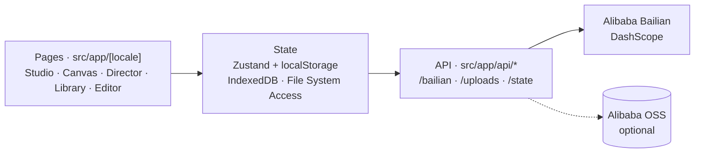

<div align="center">

# FRAME / 0 · openFrame

### 与机器共同导演 · _Direct alongside the machine_

An open-source **AI film-production workbench** — not a prompt box, a director's chair.
Turn a one-line idea into a finished short film: _prompt → tune → submit → stitch → ship_, the whole pipeline in one app.

<br/>

[](LICENSE)
[](https://nextjs.org)
[](https://react.dev)
[](https://www.typescriptlang.org)
[](https://tailwindcss.com)
[](https://github.com/pmndrs/zustand)
[](https://bailian.console.aliyun.com)
[](https://ffmpegwasm.netlify.app)
[](https://next-intl.dev)
[](#-contributing)
[]()

[Features](#-features) · [Quick Start](#-quick-start) · [Configuration](#-configuration) · [Architecture](#-architecture) · [Deployment](#-deployment) · [License](#-license)

</div>

---

## ✨ Overview

**FRAME/0** is an AI video-production workbench built on **Alibaba Cloud Bailian (DashScope)** and a roster of video models (Wan, Kling, PixVerse, HappyHorse…). It is organized around a **director's mindset**: you supply intent, pacing and emotion; the machine handles pixels, shots and continuity. Prompts are scaffolding, not the product.

> [!NOTE]
> Built on **Next.js 16**, which ships breaking changes vs 14/15 (APIs, conventions, file layout). Read [`AGENTS.md`](AGENTS.md) and `node_modules/next/dist/docs/` before contributing — don't assume older Next.js knowledge.

<!-- 👉 Add a hero screenshot or demo GIF here -->
<!-- <p align="center"></p> -->

## 🎬 Features

| | Module | What it does |
|---|---|---|
| 🎛 | **Studio · 工坊** | Run one prompt across **multiple video models concurrently**; collect candidates and pick the best. |
| 🪢 | **Canvas · 画布** | A flowith-style **node canvas** for short-drama creation — input/output nodes, visual lineage, shot-by-shot relay with **tail-frame continuation**, per-shot model & voice control, a drama progress dock. |
| 🎬 | **Director · 导演台** | Reference images + structured input → an AI-composed prompt → video, with **multi-character face-lock (r2v)**. |
| 🗂 | **Library · 资产库** | Every generation archived — search, filter, favorite, bulk download, JSON export. |
| ✂️ | **Editor · 剪辑** | Multi-clip stitching, transitions, subtitles and MP4 export — **fully in-browser via FFmpeg.wasm** (no server render). |
| 🔊 | **Voice & Continuity** | TTS dubbing with mixed audio; character / scene / prop continuity carried across shots. |

Plus: **中文 / English** i18n out of the box, **local-first** media storage (IndexedDB + File System Access API), and optional **Alibaba OSS** persistence for multi-replica / Kubernetes deployments.

## 🧱 Tech Stack

| Layer | Choice |
|---|---|
| Framework | **Next.js 16** (App Router, `src/app/[locale]/`) |
| UI | React 19 · TypeScript 5 |
| Styling | Tailwind CSS v4 |
| State | Zustand 5 (+ `localStorage` persist) |
| Validation | Zod 4 |
| i18n | next-intl (zh / en) |
| In-browser video | FFmpeg.wasm 0.12 |
| Storage | better-sqlite3 + Drizzle ORM · IndexedDB · File System Access API · (optional) Alibaba OSS |
| Model backend | Alibaba Cloud Bailian **DashScope** (proxies Wan / Kling / PixVerse / HappyHorse …) |

## 🚀 Quick Start

### Prerequisites

- **Node.js ≥ 20** and **[pnpm](https://pnpm.io)**
- An **Alibaba Cloud Bailian (DashScope) API key** — create one at <https://bailian.console.aliyun.com> *(optional: users can also enter their own key in-app)*

### Install & run

```bash
git clone https://github.com/ali-lanke/frame-0.git
cd frame-0
pnpm install
cp .env.example .env.local      # fill in keys, or leave blank and enter them in-app
pnpm dev
```

Open <http://localhost:3000>.

> [!TIP]
> `better-sqlite3` is a native module. If install/start complains about it, run `pnpm rebuild better-sqlite3`.

### Build for production

```bash
pnpm build && pnpm start
```

## 🔑 Configuration

Copy `.env.example` → `.env.local`. All values are optional in the sense that the app degrades gracefully, but you'll want at least a DashScope key to generate anything.

| Variable | Required | Purpose |
|---|:---:|---|
| `DASHSCOPE_API_KEY` | ✅ \* | Drives all image/video generation (Wan / Kling / PixVerse / HappyHorse). \* May be left blank to **force each visitor to bring their own key** (stored in their browser) — recommended for public deployments. |
| `REDDIT_CLIENT_ID` / `REDDIT_CLIENT_SECRET` / `REDDIT_USER_AGENT` | optional | OAuth credentials for the Reddit-powered inspiration feed. No creds → that feed simply stays empty. |
| `OSS_ENABLED` + `OSS_REGION` / `OSS_BUCKET` / `OSS_ACCESS_KEY_ID` / `OSS_ACCESS_KEY_SECRET` / `OSS_KEY_PREFIX` | optional | Persist uploads & generated videos to Alibaba OSS (off by default; needed for multi-replica / k8s). |

> 🔒 **Never commit `.env.local` or real secrets.** They're already in `.gitignore`. For Kubernetes, copy `deploy/k8s/secret.example.yaml` → `secret.yaml` and keep it out of git.

## 🏗 Architecture



- **Local-first**: media lives in the browser (IndexedDB) and optionally a user-picked disk folder via the File System Access API; the server mirrors to `data/` and, if enabled, OSS.
- **Model access** goes through `/api/bailian/*`, which proxies the DashScope protocol so every model speaks one interface.

## 🐳 Deployment

A `Dockerfile`, `docker-compose.yml` and Kubernetes manifests live in [`deploy/`](deploy/). See `deploy/README.md` for the OSS-backed, multi-replica setup.

## 🗂 Project Structure

```
src/
  app/[locale]/      # routes (Studio, Canvas, Director, Library, Editor, …)
  app/api/           # server routes (bailian proxy, uploads, state)
  components/        # UI (TopNav, Canvas, Studio, Editor, …)
  lib/               # stores, model specs, generation pipelines, sources
  styles/            # Tailwind + design tokens
messages/            # i18n (zh / en)
deploy/              # Docker + k8s
```

## 🤝 Contributing

Issues and PRs are welcome! A couple of notes:

- This runs on **Next.js 16** — please skim [`AGENTS.md`](AGENTS.md) first; older Next.js patterns may not apply.
- Keep changes surgical and match the surrounding style.
- By contributing, you agree your contributions are licensed under **AGPL-3.0**.

## 📄 License

Licensed under the **GNU Affero General Public License v3.0** — see [`LICENSE`](LICENSE).

AGPL-3.0 is a strong copyleft license: **if you run a modified version as a network service, you must offer its complete source to the users of that service.** This keeps derivatives open. For commercial terms outside AGPL, please reach out via an issue.

## 🙏 Acknowledgements

- [Alibaba Cloud Bailian / DashScope](https://bailian.console.aliyun.com) and the underlying model teams — Wan, Kling, PixVerse, HappyHorse and others.
- [Next.js](https://nextjs.org) · [React](https://react.dev) · [FFmpeg.wasm](https://ffmpegwasm.netlify.app) · [Zustand](https://github.com/pmndrs/zustand) · [next-intl](https://next-intl.dev) and the wider open-source ecosystem.

---

<div align="center">
<sub>Built with ☕ and a director's eye · FRAME/0 — 与机器共同导演</sub>
</div>
